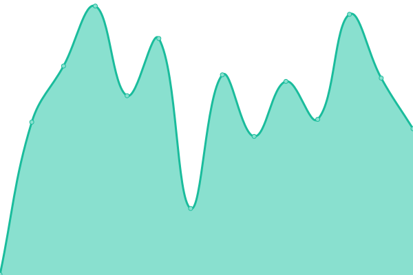

# [📈 Live Status](https://ups.serginho.dev): <!--live status--> **🟧 Partial outage**

This repository contains the open-source uptime monitor and status page for [Sérgio Glórias](https://ups.serginho.dev), powered by [Upptime](https://github.com/upptime/upptime).

With [Upptime](https://upptime.js.org), you can get your own unlimited and free uptime monitor and status page, powered entirely by a GitHub repository. We use [Issues](https://github.com/SergioGlorias/uptimeStatus/issues) as incident reports, [Actions](https://github.com/SergioGlorias/uptimeStatus/actions) as uptime monitors, and [Pages](https://ups.serginho.dev) for the status page.

<!--start: status pages-->
<!-- This summary is generated by Upptime (https://github.com/upptime/upptime) -->
<!-- Do not edit this manually, your changes will be overwritten -->
<!-- prettier-ignore -->
| URL | Status | History | Response Time | Uptime |
| --- | ------ | ------- | ------------- | ------ |
|  [Blog](https://serginho.dev/) | 🟩 Up | [blog.yml](https://github.com/SergioGlorias/uptimeStatus/commits/HEAD/history/blog.yml) | 

 164ms
     
 | 

<a href="https://ups.serginho.dev/history/blog">100.00%</a>
    

|  [Serginho Pesquisas](https://search.serginho.dev/) | 🟩 Up | [serginho-pesquisas.yml](https://github.com/SergioGlorias/uptimeStatus/commits/HEAD/history/serginho-pesquisas.yml) | 

 380ms
     
 | 

<a href="https://ups.serginho.dev/history/serginho-pesquisas">100.00%</a>
    

|  [API](https://api.serginho.dev/) | 🟥 Down | [api.yml](https://github.com/SergioGlorias/uptimeStatus/commits/HEAD/history/api.yml) | 

 130ms
     
 | 

<a href="https://ups.serginho.dev/history/api">0.00%</a>
    

<!--end: status pages-->

[**Visit our status website →**](https://ups.serginho.dev)

## 📄 License

- Powered by: [Upptime](https://github.com/upptime/upptime)
- Code: [MIT](./LICENSE) © [Sérgio Glórias](https://ups.serginho.dev)
- Data in the `./history` directory: [Open Database License](https://opendatacommons.org/licenses/odbl/1-0/)
